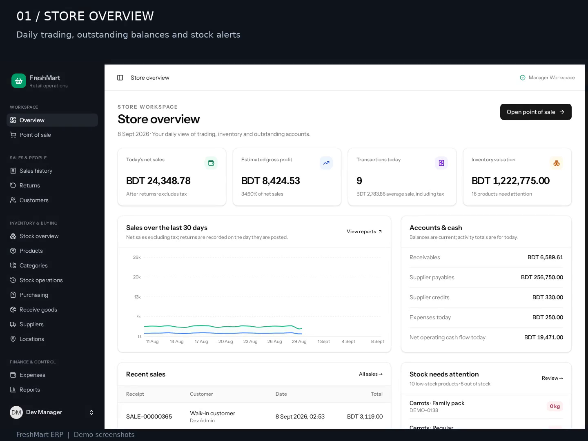
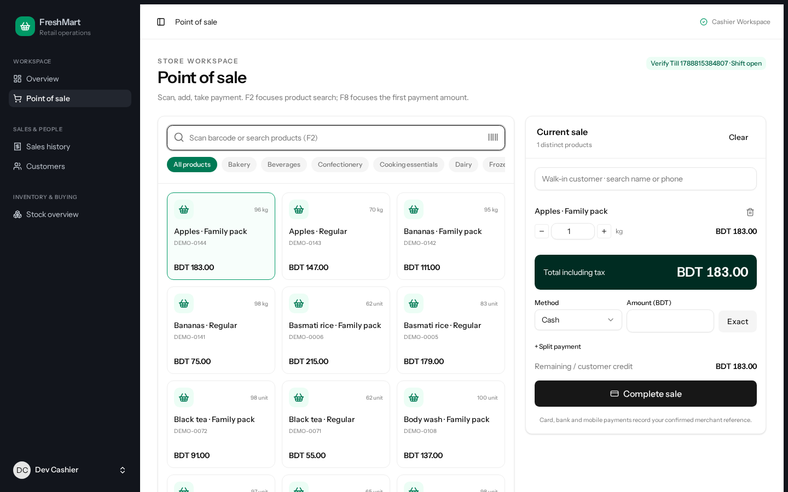
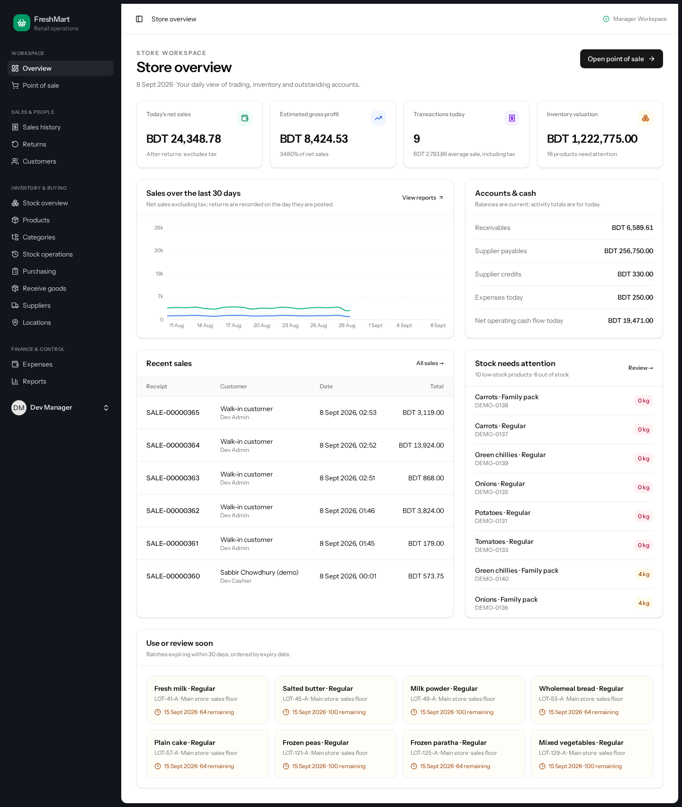
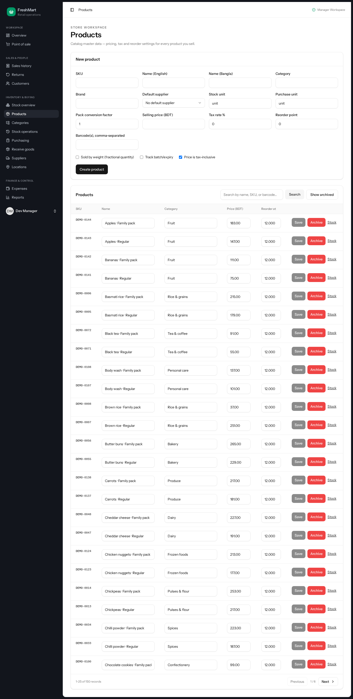
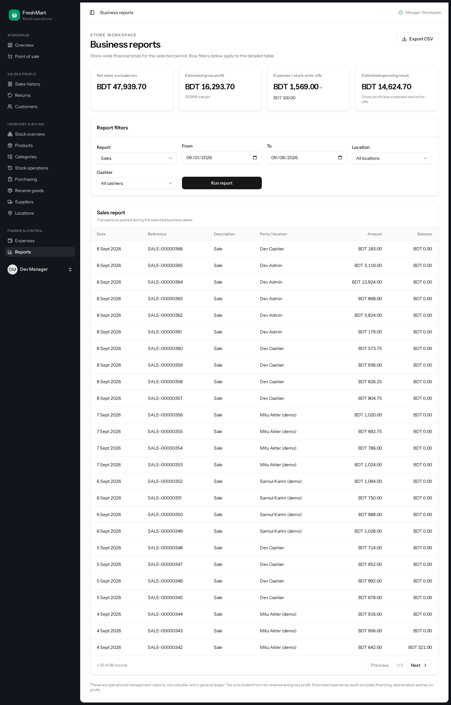

<div align="center">

# FreshMart ERP

**A connected workspace for supermarket sales, stock, purchasing and finance.**

Built for a single store with multiple stock locations. Designed around the everyday work of cashiers, store managers, inventory teams and accountants.

[](https://github.com/azmainm1-bit/freshmart-erp/actions/workflows/ci.yml)
[](LICENSE)

**Laravel 13 · React 19 · TypeScript · Inertia · Tailwind CSS 4 · PostgreSQL**

[Product tour](#see-it-in-action) · [Run locally](#run-it-locally) · [Engineering](docs/ARCHITECTURE.md) · [Verification](docs/VERIFICATION.md)

</div>

[](docs/media/freshmart-tour.mp4)

## What it solves

A checkout should update stock, payments and reporting together. A delivery should update inventory and supplier balances. A return should reverse the right quantities and amounts without losing its history.

FreshMart brings those workflows into one application, with role-based access and a transaction history that can be checked against the underlying stock and payment records.

| For the team | What they can do |
| --- | --- |
| **Cashiers** | Find products by name or barcode, sell weighted items, take split payments, issue receipts and reconcile their till. |
| **Store managers** | Review trading, authorize discounts and returns, inspect low stock and monitor outstanding balances. |
| **Inventory staff** | Receive goods, track batches and expiry dates, transfer stock and record adjustments or write-offs. |
| **Purchasing & finance** | Create purchase orders, record supplier payments, track customer credit, log expenses and export reports. |
| **Administrators** | Manage staff, assign roles and review the audit history. |

## See it in action

[**Watch the product tour — MP4**](docs/media/freshmart-tour.mp4) · [Screenshot gallery](docs/DEMO.md)

The video is a captioned walkthrough of the supplied application screenshots, using demo records. It is a visual tour, not a recording of a newly executed checkout. See [media provenance and demo steps](docs/DEMO.md).

<details>
<summary>Browse the full-size application screenshots</summary>

**Point of sale**



**Store overview**



**Product catalog**



**Business reports**



[Open the mobile dashboard screenshot](docs/screenshots/dashboard-mobile.png)

</details>

## From delivery to daily close

1. **Order and receive:** create a purchase order, receive quantities and capture batch or expiry information.
2. **Track availability:** inspect stock by location and act on low-stock or expiry alerts.
3. **Sell:** open a till, build a basket and post a sale with the appropriate payment methods.
4. **Resolve exceptions:** record returns, stock adjustments or customer payments with their history preserved.
5. **Review and close:** reconcile the till, inspect reports and check business-record consistency.

## Engineering that supports the workflow

| Concern | Implementation |
| --- | --- |
| Money accuracy | Decimal value objects for money, quantity and cost; explicit rounding rules instead of floating-point business arithmetic. |
| Concurrent sales | PostgreSQL transactions and row locks protect stock changes. Tests include competing attempts to buy the last unit. |
| Retried submissions | Database-backed idempotency keys let transactional requests replay their original result. |
| Access control | Five staff roles with server-side permissions; hiding a button is not the authorization boundary. |
| Traceability | Stock movements, posted documents, payment allocations and audit records preserve the history of business actions. |
| Consistency checks | `php artisan erp:reconcile` checks related stock, sales, payment, return, purchasing and till records. |
| Maintainability | Domain services contain posting logic; Laravel controllers, validation and Inertia pages share one application. |

Read the [architecture and design decisions](docs/ARCHITECTURE.md) for the code paths and trade-offs.

## Run it locally

**Requirements:** Docker with Compose v2, Node.js 22 LTS and npm. On Windows, run the Bash helpers in WSL2 with Docker Desktop integration enabled. Native PHP is optional because the helpers use the included PHP 8.3 container.

From a fresh checkout:

```bash
git clone https://github.com/azmainm1-bit/freshmart-erp.git
cd freshmart-erp/laravel
bin/setup-demo
bin/serve-dev.sh
```

Open **http://localhost:8000**. The setup creates local demo data and a separate PostgreSQL test database. It stops if `.env` already exists; it does not reset an existing installation.

| Demo username | Demo password | Role |
| --- | --- | --- |
| `manager1` | `manager123` | Manager — recommended for the product tour |
| `admin` | `admin123` | Administrator |
| `cashier1` | `cashier123` | Cashier |
| `accountant1` | `accountant123` | Accountant |

These are intentionally public **local demo credentials**. Demo seeding is restricted to `local` and `testing`. A real deployment uses the role seeder and `app:create-admin`; see [operations](docs/OPERATIONS.md).

For native PHP, existing installations, troubleshooting and commands explained step by step, see the [setup guide](docs/SETUP.md).

## Quality checks

Run from `laravel/` after setup:

```bash
bin/run php artisan test
bin/run vendor/bin/phpstan analyse --memory-limit=1G
bin/run vendor/bin/pint --test
npm run typecheck
npm run lint:check
npm test
npm run build
bin/run php artisan erp:reconcile
```

GitHub Actions is configured to run the frontend checks and PHP checks against an isolated PostgreSQL service. The badge above reports the actual workflow status; [verification notes](docs/VERIFICATION.md) distinguish checks performed for this package from checks still requiring the full runtime.

## Project layout

| Path | Purpose |
| --- | --- |
| `laravel/app/Support/` | Business services, decimal types, stock posting, idempotency and reconciliation |
| `laravel/app/Http/` | Controllers, request validation and middleware |
| `laravel/database/` | Schema migrations, factories and guarded demo seeders |
| `laravel/resources/js/` | React pages, shared components, formatting and frontend pricing logic |
| `laravel/tests/` | Unit, feature, concurrency and frontend pricing tests |
| `laravel/bin/` | Local setup and PHP container helpers |
| `docs/` | Setup, architecture, operating notes, screenshots and product video |
| `.github/workflows/` | Automated quality checks |

The obsolete Node/Express application, installed dependencies, database backups, runtime files and machine-specific work logs are excluded. Lockfiles, migrations, tests and the license are retained.

## Scope and honest limitations

This is a **single-store retail operations portfolio project** with BDT currency and Asia/Dhaka business-time settings. Multiple inventory locations are supported; separate branches and multi-tenant businesses are not implemented.

It is not a double-entry general ledger. External payment processing, fiscal-printer integrations, offline checkout and legacy data migration are outside this version. Recording a card or mobile payment does not charge a payment provider.

A production deployment still needs environment-specific HTTPS, process supervision, backups and restore testing, operational monitoring and business acceptance testing. This repository does not claim a production rollout, security certification or measured scale.

## License

[MIT](LICENSE). Demo records are fictional fixtures for local evaluation.
