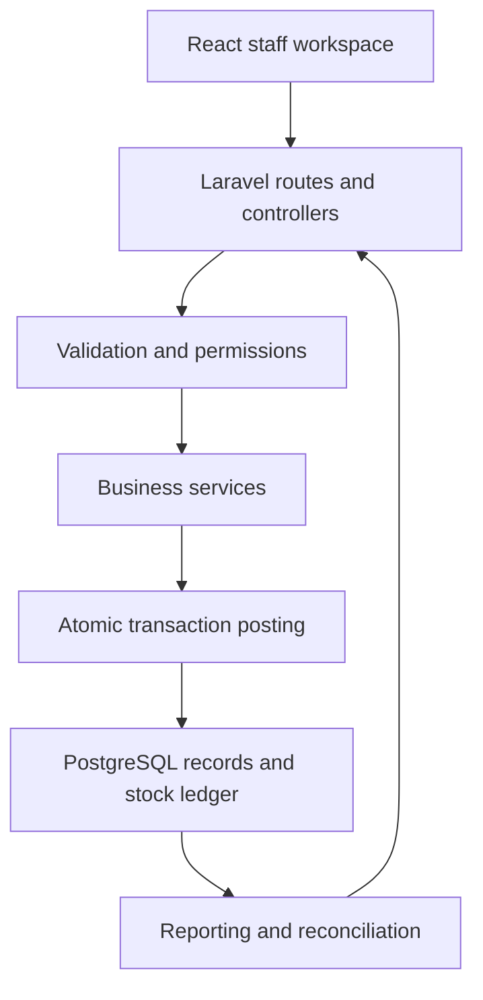

# Architecture and engineering decisions

## One application, separate business responsibilities

FreshMart uses Laravel for routing, validation, authorization and persistence. Inertia supplies page data to React without requiring a second independently deployed frontend API. React renders the interface in the browser; this package does not configure an Inertia server-side rendering process.

Controllers are grouped by catalog, sales, purchasing, inventory, finance and administration. Domain services live in `laravel/app/Support/`. The React pages live in `laravel/resources/js/pages/`.

## Posting business transactions

A typical write validates the payload, checks permission, obtains the idempotency guard, executes the business service inside a database transaction and returns its result. Exact control flow varies by operation; read the service and associated feature tests before changing it.

| Responsibility | Source |
| --- | --- |
| Sale calculation and posting | `app/Support/Sales/SalePricing.php`, `SaleService.php` |
| Till operations | `app/Support/Sales/ShiftService.php` |
| Customer returns and payments | `app/Support/Sales/SalesReturnService.php`, `CustomerPaymentService.php` |
| Stock movements and availability | `app/Support/Inventory/StockLedger.php` |
| Goods receipts | `app/Support/Inventory/GoodsReceiptService.php` |
| Purchasing and supplier settlements | `app/Support/Purchasing/` |
| Request replay and conflict handling | `app/Support/Idempotency/IdempotentOperation.php` |
| Operational reports and consistency checks | `app/Support/Reporting/` |

All paths in this table are relative to `laravel/`.

## Money, quantities and rounding

Money uses two decimal places, quantities three and costs four. The decimal value objects use `brick/math`. The backend controls posted totals; frontend pricing helps the operator preview a basket. Decimal values crossing the application boundary are represented as strings rather than binary floating-point business values.

For example, a BDT 100 item discounted by 20% has a BDT 80 taxable base; exclusive 5% tax adds BDT 4. The test suite includes this ordering so changes do not accidentally tax the original amount.

## Stock integrity and concurrency

Stock writes use transactions and row locks. A stock balance is paired with stock movements so current quantity and its history can be compared. Negative stock is rejected by the posting path. Batch, location and disposition matter: a returned item sent to quarantine must not become saleable stock by accident.

The PostgreSQL feature tests exercise competing stock deductions with separate processes. SQLite is not a substitute for validating PostgreSQL locking or the concurrency guarantees. The suite is configured for the dedicated `supermarket_erp_laravel_test` database and includes a guard against accidentally targeting another database.

## Retried requests

Transactional operations use idempotency keys. Repeating an operation with the same accepted identity can return the original result; reusing an identity with a conflicting request is rejected. Database-backed recording keeps the idempotency decision and business writes within the transactional boundary. This is especially useful after an interrupted browser request, when the operator cannot tell whether the server already posted it.

It does not provide offline checkout or guarantee delivery through an external payment provider. Those are separate integrations.

## Authorization and auditability

Spatie permissions define five staff roles: admin, manager, cashier, inventory and accountant. Authorization is checked on the server. Public staff registration is disabled; administrators create staff accounts. The last-active-administrator guard protects administrative access.

Mutations are recorded through the audit mechanism. Document numbers and links between sale lines, allocations, payments, stock movements and returns support investigation and reconciliation. Audit history is an application record, not a claim of tamper-proof compliance storage.

## Reporting and reconciliation

Management reports read operational transactions, with CSV exports for further analysis. BDT and Asia/Dhaka are the configured business defaults. `erp:reconcile` checks related records across stock, sales, payment allocations, returns, purchasing, transfers and tills. Run it after demo seeding and as part of a release rehearsal.

Reconciliation checks internal consistency; it does not independently confirm a bank settlement or a physical stock count. This version is not a double-entry accounting ledger.

## Repository cleanup

The source archive contained an earlier Node/Express/Prisma application alongside the active Laravel implementation. This portfolio package retains Laravel and removes the duplicate application, its root workspace manifest, database backups, generated output and machine-specific notes. The uploaded archive remains the original migration reference.

Migrations, meaningful tests, dependency lockfiles and framework-required files remain. A generated `assertTrue(true)` example test and an unconfigured SSR entrypoint were removed. Composer and npm dependencies are installed from their lockfiles, not shipped inside the source ZIP.
